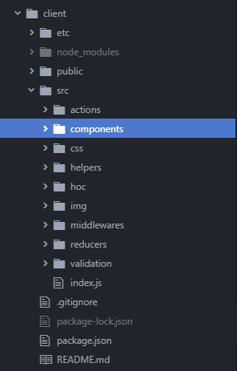

# React JS
React JS is an open source Javascript library which is used for building interfaces. It lets you build complex UI's from small to isolated pieces of code using "components" while making sure its in sync with the state

## Table of Contents
- [Create React App](#create-react-app)
- [JSX](#jsx)
- [Virtual DOM](#virtual-dom)
- [Components](#components)
- [State](#state)
- [Events](#events)
- [CSS](#css)
- [Project Structure](#project-structure)

## Create React App
There are couple things you need to install before you can create your first react app
- First you need to download npm and NodeJs. Proceed to the website https://www.npmjs.com/get-npm
- Once installed use the command
```bash
npm install -g create-react-app
```
**Note:** make sure you put the -g.
- After installing the create-react-app npm package you are now able to use create-react-app command
- What is create-react-app? create-react-app is an already compiled environment for developing react apps.
- Creating your first react app
```bash
create-react-app app-name
```
- It will install lightweight development server
- [Webpack](../../tools/webpack.md)(Bundler)
- [Babel](../../tools/babel.md)(Bundler)

It also enables hot module reloading, which means we don't have to re-build and refresh after each change.

### Eject
This will permanently add all the abstracted dependencies in package.json and the config files will appear. This allows detailed configurations.

```bash
npm run eject
```

## Hello World
Once you have created your first react app change the directory to that app and open an IDE of your choice.
You can edit index.js
```javascript
// React object from module.
import React from "react";
import ReactDOM from "react-dom";

const element = <h1>Hello World</h1>; // JSX expression

ReactDOM.render(element, document.getElementById('root'));
```

## JSX
What is JSX? It's syntactic sugar for creating HTML elements with javascript, instead of using templating engines. It's not a string, but an expression.
```jsx
const element = <h1>Hello World</h1>;
```

Babel transpiles it into...

```javascript
var element = React.createElement("h1", null, "Hello World");
```

Since the compiled JSX makes a call to `React.createElement`, we need to import `React`, even if we don't use the object directly.

This returns an `Object`, a React element, which is part of the virtual-DOM.

The call to the function is the reason why we need one parent element, as Babel gets confused with multiple.

## Virtual-DOM

Lightweight in-memory representation of the UI. Instead of re-building the DOM on each change, the virtual DOM sees the changes and it just updates the changed parts in the real DOM.

Whenever the state of the React element object changes...

-   React gets a new React element.
-   Compares it to the previous one to see the changes.
-   Update just the changed parts in the real DOM.

The DOM updating is done by the `render()` method in the `react-dom` module. It takes the object returned from JSX and renders the HTML inside the referenced div.

## Components

A piece of UI. A javascript class that has some state to be displayed and a render method.

**counter.jsx**

```javascript
import React, { Component } from "react";

class Counter extends Component {
    render() {
        return (
            <div>
                <div>Counter</div>
                <button>Increment</button>
            </div>
        );
    }
}

export default Counter;
```

**index.js**

```javascript
import React from "react";
import ReactDOM from "react-dom";
import Counter from "./components/counter";

ReactDOM.render(<Counter />, document.getElementById("root"));
```

## State

`setState` is used for updating the state AND re-rendering the view i.e. syncing the DOM with the virtual DOM.

The method takes an object, and merges or overwrites the state object with it.

If we update the state directly, React is unaware of the change, and nothing is rendered.

## Events

The event naming convention is to prefix the function with `handle`.

```javascript
class Foo extends Component {
    handleSomething() {
        console.log("Something handled");
    }

    render() {
        return <button onClick={this.handleSomething}>Do something</button>;
    }
}
```
### Binding this

`onClick={this.handleSomething}` results in `undefined`, because `this` references the global object and React runs in `strict mode`.

#### Arrow function

```javascript
class Foo extends Component {
    state = {
        bar: "bar"
    };

    handleSomething = () => {
        console.log(this.state.bar);
    };

    render() {
        return <button onClick={this.handleSomething}>Do something</button>;
    }
}
```

#### bind()

Since we cannot use `onClick={this.handleSomething("value")}`, we need to use an arrow function.

```javascript
class Foo extends Component {
    state = {
        bar: "bar"
    };

    handleSomething() {
        console.log(this.state.bar);
    }

    render() {
        return (
            <button onClick={this.handleSomething.bind(this)}>
                Do something
            </button>
        );
    }
}
```

### Event arguments

```javascript
class Foo extends Component {
    state = {
        bar: "bar"
    };

    handleSomething = argument => {
        console.log(argument);
    };

    render() {
        return (
            <button onClick={() => this.handleSomething("baz")}>
                Do something
            </button>
        );
    }
}
```

## CSS
CSS in reactjs uses lowercamel case instead of the traditional css namings.

This is a sample of an inline CSS style declaring it as an object.
```javascript
class Foo extends Component {
    styles = {
        fontSize: 10,
        fontWeight: "bold"
    };

    render() {
        return <div style={this.style}>Some text</div>;
    }
}
```
This is a sample of an inline CSS style.
```javascript
class Foo extends Component {
    render() {
        return (
            <div style={{ fontSize: 30, fontWeight: "bold" }}>Some text</div>
        );
    }
}
```

You can also import an external CSS style using import statements in your .js files

```javascript
import React, { Component } from react;
import './css/styles.css';

class ExternalCSS extends Component{
  render(){
    //instead of using class="" we will need to use className
    return(
      <div className="sampleid">Hello World</div>
    );
  }
}
```

## Project Structure
The attached image is the project structure I follow. For me its easier to know where I store my components<br/>

